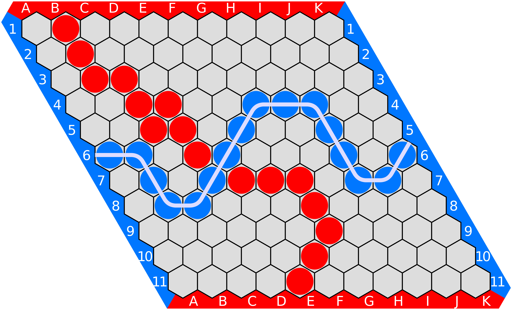

# HexGame-Platform

<p align="center">
  
  
</p>
<p align="center">
  
  
  
</p>

## Overview

**HexGame-Platform** is a robust, modular, and extensible platform for playing, analyzing, and managing games of **Hex** — a classic two-player board game with deep strategic elements, often compared to chess or Go. This project is designed as a practical application of advanced object-oriented programming principles, refactoring, and the KISS philosophy, leveraging Python, Flask, and modern web technologies to deliver a high-quality, maintainable codebase.

---

## What is Hex?

**[Hex (board game)](https://en.wikipedia.org/wiki/Hex_(board_game))** is a turn-based board game played on a hexagonal grid. Two players take turns placing stones of their color, aiming to connect their respective sides of the board. The game is renowned for its elegant rules and strategic depth, making it a favorite among mathematicians and game theorists.



---

## Features

- **Play Hex Locally**: Human vs Human, Human vs AI, or AI vs AI.
- **Modern Web Interface**: Intuitive UI built with Flask, HTML, CSS, and JavaScript.
- **Game Management**: Save, load, and resume games in multiple formats (JSON, XML, SQLite).
- **Statistics & Replays**: Track player stats, view game histories, and replay past games.
- **Player Accounts**: Manage player profiles and individual statistics.
- **AI & Agent Training**: Environment for training and supervising AI agents (including reinforcement learning).
- **Extensible & Modular**: Easily add new features, AI strategies, or data formats.
- **Comprehensive Testing**: Rigorous unit, integration, and end-to-end tests using Pytest.
- **Full Documentation**: Detailed docstrings, usage examples, and architectural diagrams.
- **Game Database Management**: Designed to handle large sets of Hex games, paving the way for future AI model training and research on game strategies.

---

## Technologies Used

- **Python 3**
- **Flask** (web framework)
- **HTML5, CSS3, JavaScript** (frontend)
- **Pytest** (testing)
- **Object-Oriented Design** (SOLID principles, design patterns, refactoring, KISS)
- **JSON, XML, SQLite** (data storage)
- **Modular MVC Architecture**

---

## Project Structure

```
HexGame-Platform/
│
├── app.py                  # Flask application entry point
├── src/                    # Source code (MVC: models, controllers, views)
│   ├── models/             # Game logic, AI, data management
│   ├── controllers/        # Game and UI controllers
│   └── ...
├── static/                 # CSS, JS, images
├── templates/              # HTML templates (Flask)
├── data/                   # Saved games, player data, etc.
├── tests/                  # Unit, integration, and end-to-end tests
├── requirements.txt        # Python dependencies
├── README.md               # Project documentation
└── ...
```

---

## Getting Started

1. **Clone the repository**
   ```bash
   git clone https://github.com/yourusername/HexGame-Platform.git
   cd HexGame-Platform
   ```

2. **Install dependencies**
   ```bash
   pip install -r requirements.txt
   ```

3. **Run the application**
   ```bash
   python app.py
   ```
   Then open your browser at [http://localhost:5000](http://localhost:5000).

4. **Run tests**
   ```bash
   pytest
   ```

---

## Code Quality & Best Practices

- **SOLID Principles**: Each class and module has a single responsibility and is open for extension.
- **Design Patterns**: Factory, Strategy, and MVC are used for flexibility and maintainability.
- **Refactoring & KISS**: The codebase is continuously improved for simplicity and clarity.
- **English Naming**: All code is written in English for clarity and collaboration.
- **Comprehensive Documentation**: Every class and method is documented.
- **Extensive Testing**: High test coverage ensures reliability.

---

This project is a passion project — a playground for coding, experimenting, and training AI models.

A special thank you to the team behind [playhex.org](https://playhex.org/) and the [playhex GitHub project](https://github.com/playhex/playhex), who keep the Hex game community alive and generously share Hex game databases [exported game data](https://playhex.org/export-games-data).
